# TripWeave

TripWeave is a collaborative group trip planner built with Flutter, Riverpod, and Supabase.

The app is designed for a small group planning one trip together: create the trip, invite members, suggest activities, vote, approve items into the itinerary, and track shared expenses.

## Screenshots

<p>
  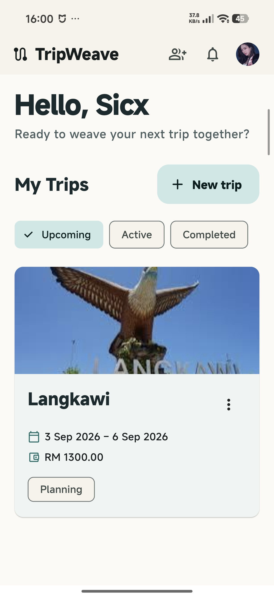
  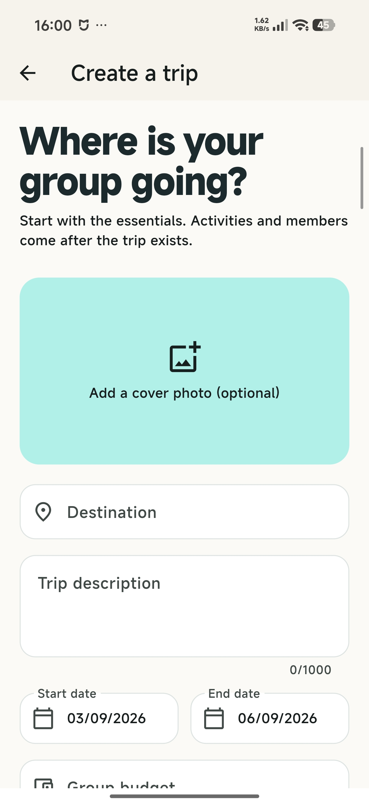
  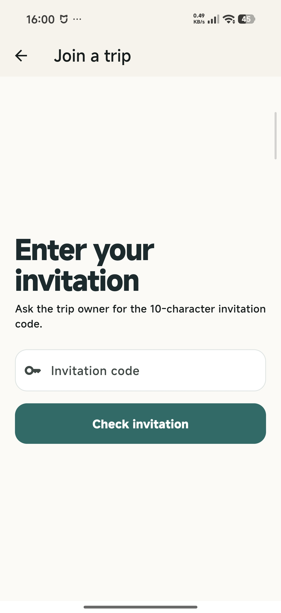
</p>

<p>
  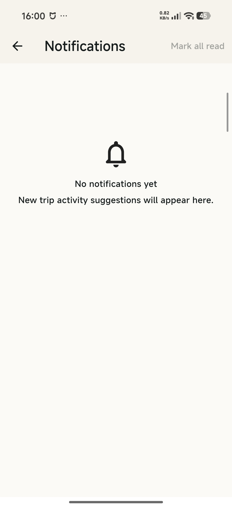
  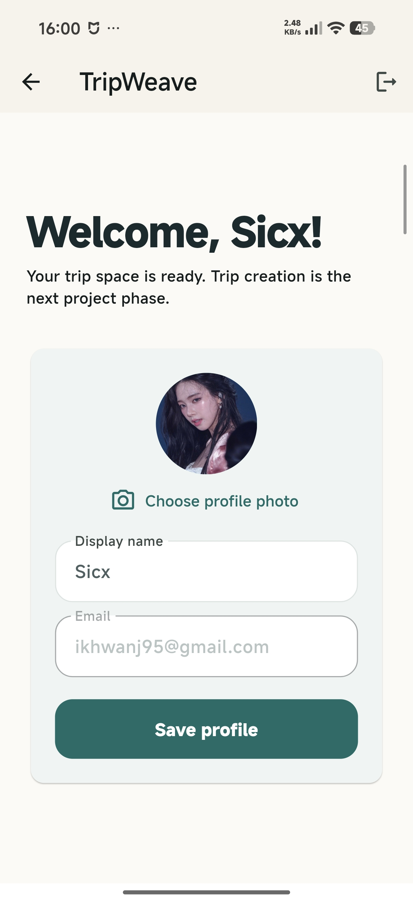
  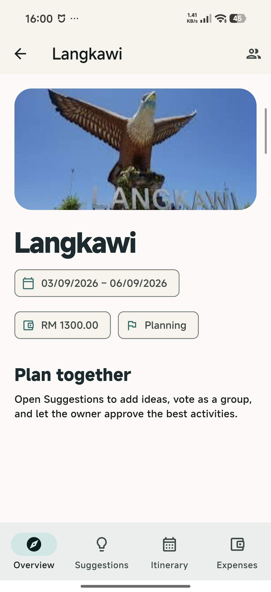
</p>

<p>
  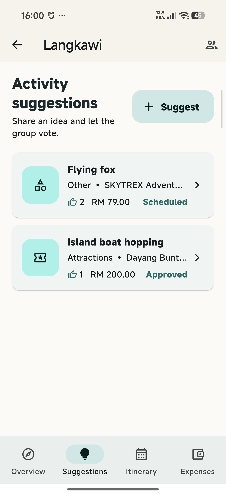
  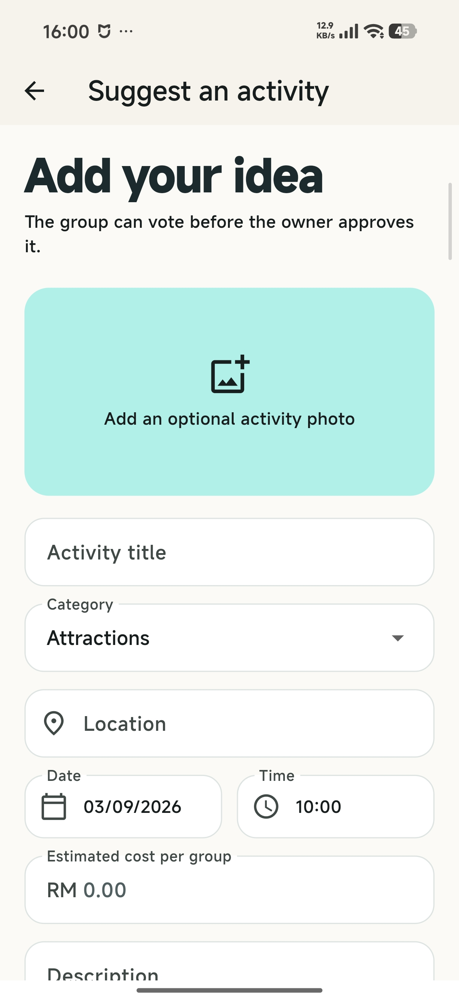
  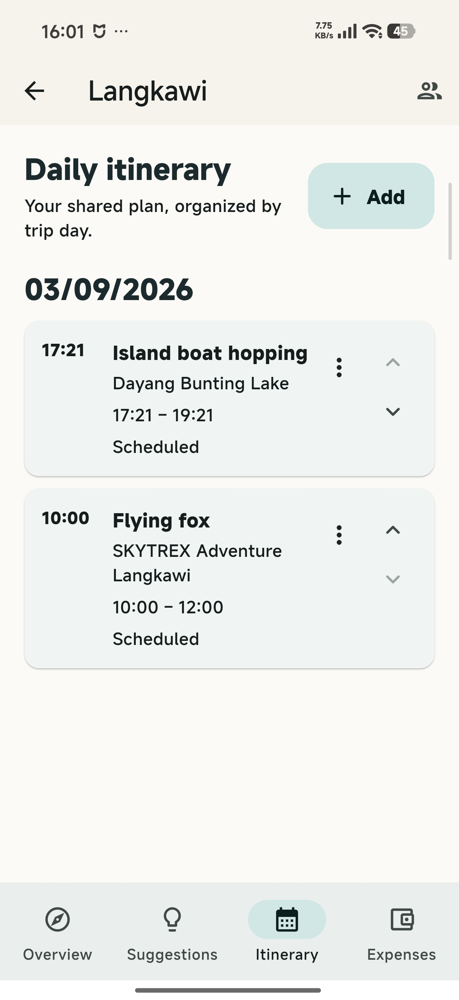
</p>

<p>
  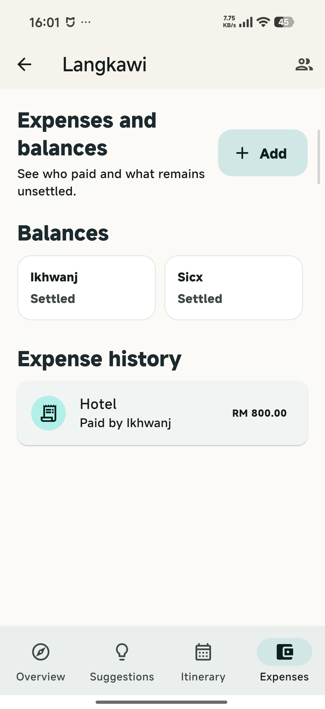
  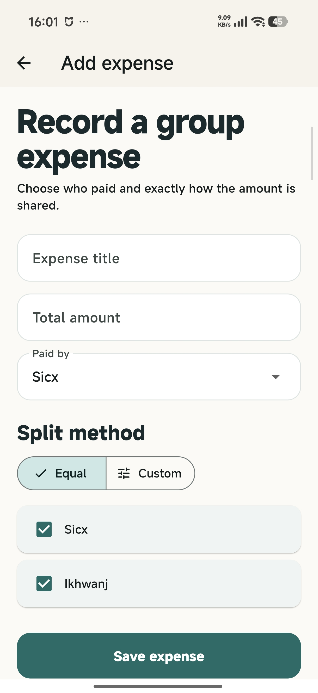
  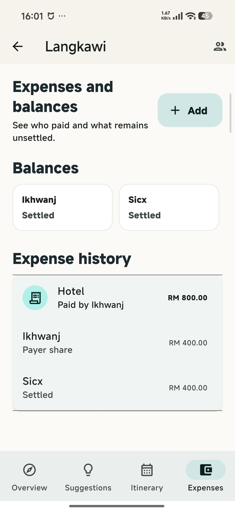
</p>

<p>
  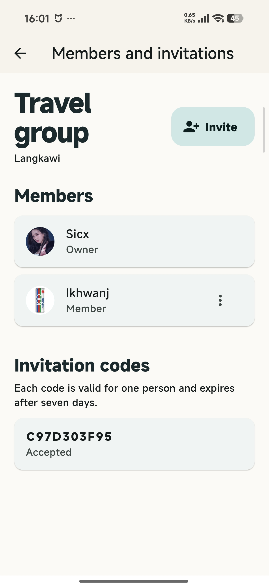
</p>

## Current Status

TripWeave now covers the main MVP flow:

1. Register or sign in
2. Create a trip
3. Invite or manage members
4. Suggest activities
5. Vote and comment on suggestions
6. Approve activities into the itinerary
7. Track shared expenses and balances
8. Receive in-app suggestion notifications

Some advanced production features are still partial. See `Known Gaps` below.

## Features

### Account Management

- Email registration and sign in
- Password reset email
- Editable profile name
- Profile photo upload through Supabase Storage
- Auth gate that sends signed-out users to login and signed-in users to the dashboard
- Safe configuration screen when Supabase values are missing

### Trip Management

- Create trips with destination, dates, description, budget, and optional cover image URL
- View trips from the dashboard
- Open trip overview from a trip card
- Edit existing trip details
- Trip statuses such as planning, active, completed, archived, and cancelled
- Owner/member structure in the database

### Members And Invitations

- View trip members
- Invite members with a generated invite code/link style flow
- Join a trip using an invitation code
- Accept/decline style invitation data model
- Leave/remove member support at repository/database level

### Activity Suggestions

Members can propose activities such as:

- Attractions
- Restaurants
- Accommodation
- Transport
- Shopping
- Custom activities

Each proposal can include:

- Title
- Location
- Date and preferred time
- Estimated cost
- Description
- Optional image URL
- Submitted-by profile information
- Voting totals
- Comments

Trip owners can approve proposals so they can be added into the itinerary.

### Shared Itinerary

- Organize activities by trip day
- Schedule approved suggestions
- Set start and end time
- Mark itinerary items as completed
- Conflict detection support
- Version fields in the data model for safer collaborative updates

### Expenses

- Add a shared expense
- Select who paid
- Split equally across selected members
- Store participant split records
- Show member balances
- Mark split payments as settled

### Notifications

- In-app notification list
- Notification records for new suggestions
- Mark notifications as read
- Suggestion notifications connected through Supabase migration

## Architecture

TripWeave uses a feature-first MVVM-style structure.

In simple terms:

- `Model` means the app's data shape, such as `Trip`, `ActivityProposal`, or `Expense`.
- `View` means the screen/widgets the user sees.
- `ViewModel` means the state/controller layer that prepares data for the view and handles actions.
- `Repository` means the data access layer that talks to Supabase.

This project uses Riverpod providers as the ViewModel/controller layer.

```text
lib/
  app/                         app entry and routing shell
  core/
    config/                    Supabase configuration
    theme/                     shared Material theme
    utils/                     shared helpers
  features/
    auth/
      data/repositories/       Supabase auth implementation
      domain/entities/         AppUser model
      domain/repositories/     Auth repository contract
      presentation/providers/  auth state and actions
      presentation/screens/    login, register, reset, profile
      presentation/widgets/    reusable auth UI
    trips/
      data/repositories/       Supabase trip implementation
      domain/entities/         Trip model
      domain/repositories/     Trip repository contract
      presentation/providers/  trip state and actions
      presentation/screens/    trip overview, create/edit
      presentation/widgets/    trip cards
    members/
      data/repositories/       Supabase member/invite implementation
      domain/entities/         TripMember and TripInvitation models
      domain/repositories/     member repository contract
      presentation/providers/  member and invitation state
      presentation/screens/    members and join trip screens
    activities/
      data/repositories/       Supabase proposal/comment/vote implementation
      domain/entities/         proposal and comment models
      domain/repositories/     activity repository contract
      presentation/providers/  activity state and actions
      presentation/screens/    suggestions, details, add activity
      presentation/widgets/    proposal cards
    itinerary/
      data/repositories/       Supabase itinerary implementation
      domain/entities/         itinerary item model
      domain/repositories/     itinerary repository contract
      presentation/providers/  itinerary state and actions
      presentation/screens/    itinerary and schedule screens
    expenses/
      data/repositories/       Supabase expense implementation
      domain/entities/         expense, split, balance models
      domain/repositories/     expense repository contract
      presentation/providers/  expense state and actions
      presentation/screens/    expense list and add expense
    notifications/
      data/repositories/       Supabase notification implementation
      domain/entities/         notification model
      domain/repositories/     notification repository contract
      presentation/providers/  notification state and actions
      presentation/screens/    notification list
supabase/
  migrations/                  database schema, policies, triggers
test/                          unit and widget tests
```

## Supabase Setup

1. Create a Supabase project.
2. Copy `.env.example` values from your Supabase project settings.
3. Use the public anon key only. Do not put a service-role key in the Flutter app.
4. Run the migrations in this order:

```text
supabase/migrations/202609020001_auth_profiles.sql
supabase/migrations/202609020002_trips.sql
supabase/migrations/202609020003_activity_proposals.sql
supabase/migrations/202609020004_trip_invitations.sql
supabase/migrations/202609020005_itinerary_expenses.sql
supabase/migrations/202609020006_complete_core_mvp.sql
supabase/migrations/202609020007_suggestion_notifications.sql
```

If Supabase warns that a constraint already exists, it usually means one migration or part of a migration was already applied. Check the existing table first before running destructive SQL.

## Running The App

Fetch dependencies:

```powershell
flutter pub get
```

Run with Supabase configuration:

```powershell
flutter run `
  --dart-define=SUPABASE_URL=https://YOUR_PROJECT.supabase.co `
  --dart-define=SUPABASE_ANON_KEY=YOUR_PUBLIC_ANON_KEY
```

Build a release APK:

```powershell
flutter build apk --release `
  --dart-define=SUPABASE_URL=https://YOUR_PROJECT.supabase.co `
  --dart-define=SUPABASE_ANON_KEY=YOUR_PUBLIC_ANON_KEY
```

The release build needs the same `--dart-define` values. If they are missing, the app may open but cannot connect properly to Supabase.
